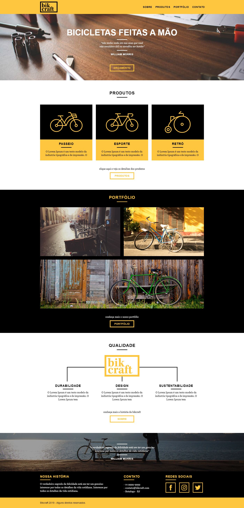

## 🚀 Projeto Bikcraft

---

# 📚 O que eu aprendi com o projeto!
- Fundamentos do design;
- Usabilidade;
- Design de Interface;
- Tags semânticas do HTML5;
- Seletores CSS;
- Grid CSS;
- Transitions CSS;
- Normalize e Reset CSS;
- Animações CSS com JS;
- Submit de formulário com JS;
- Configuração de Plugins;
- Responsividade;
- SEO e Analytics;
- Domínio e Hospedagem.

# 💻 Tecnologias

<a href='https://www.w3schools.com/html/'>HTML5</a>
 
<a href='https://www.w3schools.com/css/'>CSS3</a>
 
<a href='https://developer.mozilla.org/pt-BR/docs/Web/JavaScript'>JavaScript</a>
 
<a href='https://github.com/origamid/simple-slide'>Plugn SimpleSlide</a>
 
<a href='https://github.com/origamid/simple-anime'>Plugn SimpleAnime</a>
 
<a href='https://github.com/origamid/simple-form'>Plugn SimpleForm</a>
 
<a href='https://github.com/PHPMailer/PHPMailer'>Plugn PHPMailer</a>
 
<a href='https://github.com/sendgrid/sendgrid-php'>Plugn sendGrid</a>
 
<a href='https://code.visualstudio.com/'>Visual Studio Code</a>
 

# 📝 Sobre o projeto

- Curso Web Design - Origamid

Este é um projeto acadêmico. Seu principal objetivo é facilitar a avaliação dos professores.

---

O aprendizado é contínuo e o próximo nível nunca será o último 🚀 by [aalvs](https://app.rocketseat.com.br/me/aalvs).